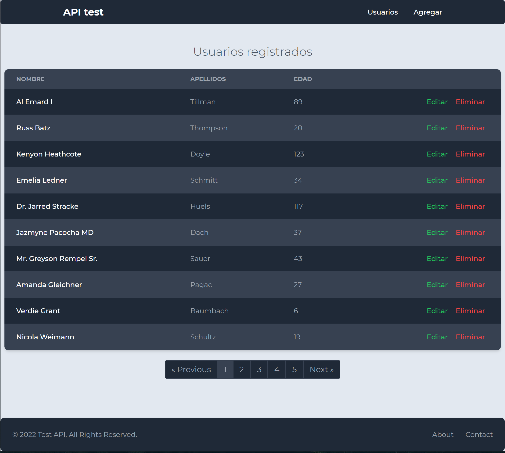

# Test API

CRUD sencillo para una tabla de usuarios (nombre apellido edad)

## Preview



## API Reference

#### Crea un nuevo registro

```http
  POST /users/new
```

| Parameter | Type     | Description                          |
| :-------- | :------- | :----------------------------------- |
| `usuario` | `Object` | **Required**. nombre, apellido, edad |

#### Elimina un registro

```http
  DELETE /users/delete/{id}
```

| Parameter | Type      | Description                             |
| :-------- | :-------- | :-------------------------------------- |
| `id`      | `integer` | **Required**. Id del usuario a eliminar |

#### Actualiza un registro

```http
  PUT /users/update/{id}
```

| Parameter | Type      | Description                              |
| :-------- | :-------- | :--------------------------------------- |
| `id`      | `integer` | **Required**. id, del usuario            |
| `usuario` | `Object`  | **Required**. id, nombre, apellido, edad |

#### Muestra el de detalle de un usuario por id

```http
  GET /users/{id}
```

| Parameter | Type      | Description                   |
| :-------- | :-------- | :---------------------------- |
| `id`      | `integer` | **Required**. id, del usuario |

#### Muestra todos los registros de la tabla

```http
  GET /users
```

## Installation

Instalar las dependencias de composer

```bash
  composer install
```

Crear la base de datos y modificar el .env para la BD

```bash
  mysql -u root
  create database api_test
  --
  DB_DATABASE=api_test
```

Realizar las migraciones

```bash
  php artisan migrate

  -- opcional usar tinker para datos ficticios
  php artisan tinker
  >> User::factory->count(50)->create();

```

Instalar las dependencias npm

```bash
  npm i
```

compilar los archivos

```bash
  npm run dev
```

## Tech Stack

**Client:** vuejs 3

**Server:** Laravel 9
